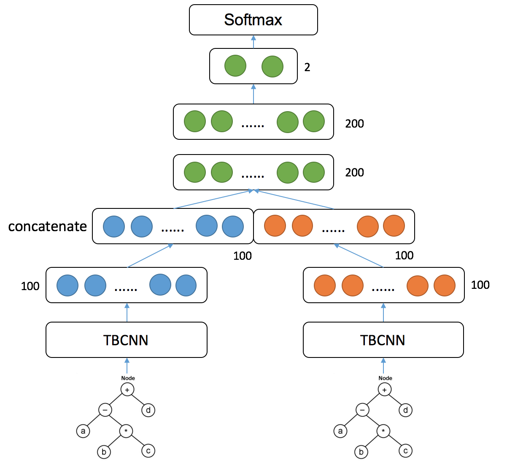
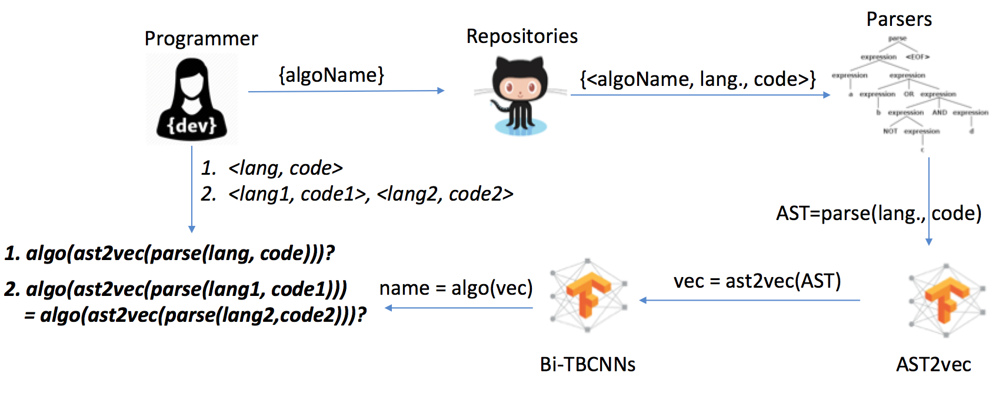

# Cross-Language Program Classification using Bilateral Tree-based Convolutional Neural Networks

The project is an implementation of Bi-TBCNN introduced in our paper accepted by <a
href="https://nl4se.github.io">the 1st Natural Languages for Software
Engineering (NL4SE) workshop at AAAI'18 conference</a>. 

You can find the paper here: https://arxiv.org/abs/1710.06159

Here's our proposed Neural Network structure. In short, this structure is a variance of the Siamese Neural Network, which is  a class of Neural Network used for finding similarity or a relationship between two comparable things. The different here is that we don't use the contrastive loss function. Instead, we concat the features of 2 comparable things into 1 aggregation vector and perform classification on that feature.



We have prepared a fully automated workflow (Figure 1) for you to classify programs against known algorithm names.


Figure 1. The workflow to use our tools

To do so, you need to first install docker command

```
sudo apt-get install docker-ce
```

Enter the following scripts on the command line to build and run the system respectively:
```
./b
./r clean
```

## Modify the inputs

Insider the `input` subfolder, you will find the following files:
```
input
├── algorithm.name
├── all.algo
├── all.lang
├── config.json
├── language.name
└── srcml_node_map.tsv
```

If you just want to see how it works, we have prepared only two algorithms as follows:

### `algorithm.name`: Names of algorithms
```
bubblesort
mergesort
```

Note. You can add more algorithm names. In the NL4SE paper, we used 6 algorithms, included in the `all.algo` file. You can replace
`algorithm.name` with `all.algo`.

### `language.name`: names of programming languages
```
java .java
cpp .cpp
```
*Note* You can add more programming languages. In the NL4SE paper, we used just C++ and Java. Other programming languages are included in the `all.lang` file. You can replace `language.name` with `all.lang`.

### `config.json`: configuration of the Github API, please subsitute it with your own username and access token. 
```
{
    "GITHUB_USERNAME": "...",
    "GITHUB_ACCESS_TOKEN": "..."
}
```

### `srcml_node_map.tsv`: the syntax node types of selected programming language(s)
```
UNIT_KIND = 0
DECL = 1
DECL_STMT = 2
INIT = 3
EXPR = 4
EXPR_STMT = 5
COMMENT = 6
CALL = 7
CONTROL = 8
INCR = 9
...
STRONG = 383
OMP_OMP = 384
SPECIAL_CHARS = 385
```

*Note* that you need to make sure this file is consistent with the underlying parser.
```
$docker run -it fasttool/fast fast -v
fast v0.0.7 commit id: 3e368dd1e56f5bb8f02673b1c7441f567eab67ee with local changes id: e1b7ca5bf36050ce774cb2650446115bb49bf91ac5d889a9dbb4911ed8130225
built with 6.4.0 on Nov 14 2017 at 20:00:04
```

If a different version of `fast` is prepared, it might require a regenerated input file `./ast2vec/ast2vec/fast_pb2.py` if there is any change in the language grammar. 

### Other parameters for tensorflow framework are stored in the following two files, each corresponds to a Tensorflow run.
```
./ast2vec/ast2vec/parameters.py
./bi-tbcnn/bi-tbcnn/parameters.py
```
